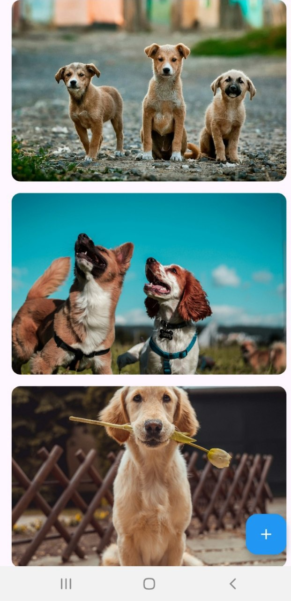
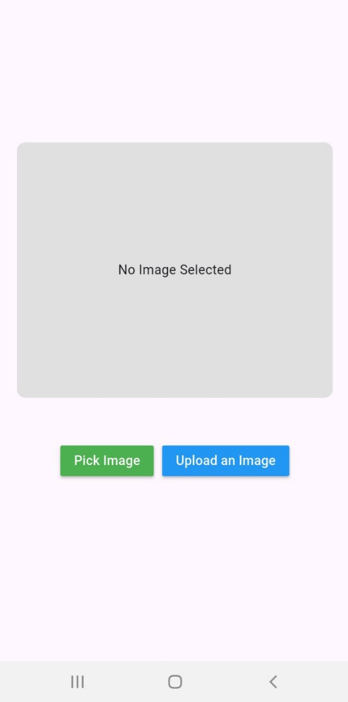

# 🐶 Dog Gallery App

A Flutter app that allows users to upload and view dog images. Built with [The Dog API](https://www.thedogapi.com/) and custom upload features,and the BLoC pattern for clean and scalable state management.This app is a fun and interactive way for users to share and enjoy dog content.
 
## 🚀 Features

- 📸 Upload dog images directly from the app.
- 🌐 View uploaded images .
- 🎨 Clean and responsive Flutter UI.
- 🔄 State management using the BLoC (Business Logic Component) pattern
- 🔒 Works on Android, iOS .

- ## 📸 Screenshots
- 
- 

## 🔐 API Key Setup

To make it work:

1. Go to [https://thedogapi.com/](https://thedogapi.com/).
2. Get your API key from the dashboard. 

   ```dart
   const String CAT_API_KEY = 'your_api_key_here';

## 📦 Packages Used

| Package                 | Description                                                                 |
|-------------------------|-----------------------------------------------------------------------------|
| http                  | For making REST API requests                                                |
| http_interceptor      | Adds request/response interceptors to the http package                      |
| logger                | Lightweight and flexible logger for debugging and error tracking            |
| cached_network_image  | Efficiently loads and caches images from the internet                       |
| image_picker          | Allows users to pick images from their device's gallery                     |
| flutter_bloc          | A predictable state management library using the BLoC (Business Logic Component) pattern |


⚠️ License
This project is not licensed yet.
If you wish to use or modify this app for commercial or educational purposes, please contact me .

